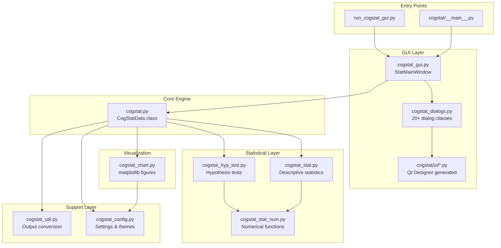
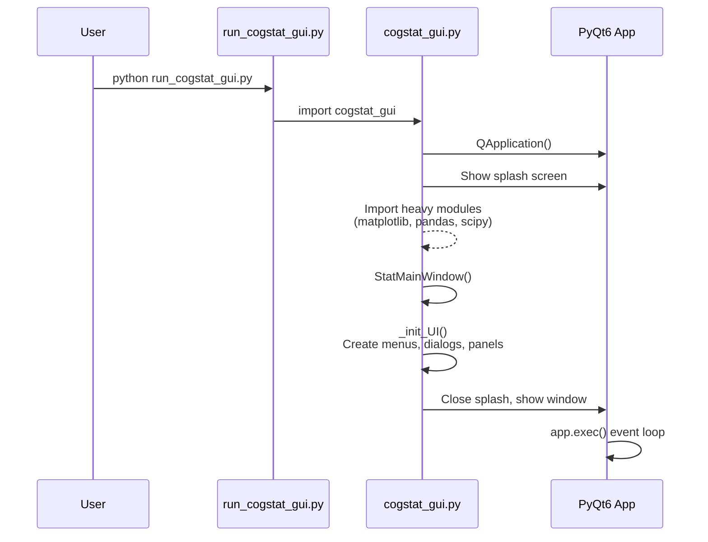
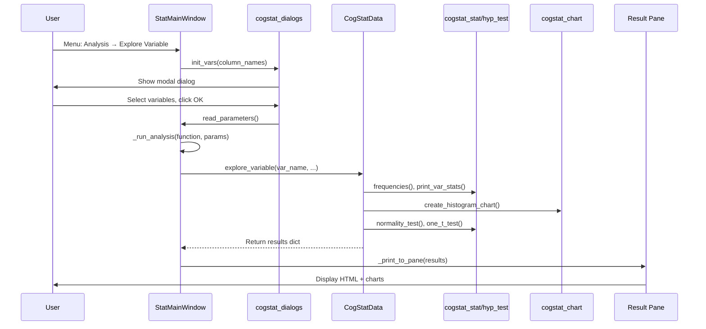

# CogStat Architecture

This document describes CogStat's internal architecture, component interactions, and data flows. For development commands and contribution guidelines, see [CONTRIBUTING.md](CONTRIBUTING.md).

## Component Overview



## Application Startup Flow



## Analysis Execution Flow



## Data Flow Pipeline

### Import Pipeline

```
User Input                    Method Chain                         Output
─────────────────────────────────────────────────────────────────────────────
File path (CSV/Excel/...)  →  CogStatData.__init__()           →  orig_data_frame
Clipboard text             →    └── _import_data()             →  data_frame (copy)
pandas DataFrame           →        ├── _percent2float()       →  data_measlevs dict
                                    ├── _special_values_to_nan()
                                    ├── _convert_dtypes()
                                    └── _set_measurement_level()
```

### Analysis Pipeline

```
GUI Action                    Processing                           Output Type
─────────────────────────────────────────────────────────────────────────────
Menu click                →  _run_analysis()                   →  GuiResultPackage
                              └── CogStatData.method()
                                  ├── Section headings         →  str (HTML)
                                  ├── Statistics tables        →  pandas.Styler
                                  ├── Charts                   →  matplotlib.Figure
                                  └── cs_util.convert_output() →  dict
                          →  _print_to_pane()
                              ├── str → append as HTML
                              ├── Figure → base64 PNG/SVG 
                              └── Styler → HTML table
```

## Key Internal Classes

### `CogStatData` (cogstat.py)

Central data container and analysis orchestrator.

| Attribute | Type | Description |
|-----------|------|-------------|
| `orig_data_frame` | pd.DataFrame | Original imported data (never modified) |
| `data_frame` | pd.DataFrame | Working copy (filtered data applied here) |
| `data_measlevs` | dict | `{'var_name': 'nom'|'ord'|'int'|'unk'}` |
| `filtering_status` | str | Current filter description for display |
| `import_source` | list | `['source_type', 'file_path']` |
| `import_message` | str | HTML message shown after import |

**Key Methods:**
- `explore_variable()` - Single variable analysis
- `explore_variable_pair()` - Bivariate analysis
- `compare_variables()` - Repeated measures
- `compare_groups()` - Independent groups
- `regression()` - Linear/polynomial regression
- `pivot()` - Pivot table generation
- `filter_outlier()` - Apply outlier filtering

### `StatMainWindow` (cogstat_gui.py)

Main application window.

| Attribute | Type | Description |
|-----------|------|-------------|
| `active_data` | CogStatData | Currently loaded dataset |
| `analysis_results` | list | List of `GuiResultPackage` for rerun |
| `result_pane` | QTextBrowser | HTML output display |
| `table_view` | QTableView | Data grid display |
| `unsaved_output` | bool | Track if results need saving |

**Key Methods:**
- `_open_data()` - Load data from any source
- `_run_analysis()` - Central dispatch for all analyses
- `_print_to_pane()` - Render results to output pane
- `_display_data()` - Update table view with data

### `GuiResultPackage` (cogstat_gui.py)

Stores analysis results for display and rerun capability.

```python
class GuiResultPackage:
    command: list   # [title, function_name, parameters_dict]
    output: dict    # Analysis results dictionary
```

### `PandasModel` (cogstat_gui.py)

Qt model adapter for displaying pandas DataFrame in QTableView.

## Dialog Lifecycle Pattern

All analysis dialogs follow this pattern:

```python
# 1. Dialog instantiated once in StatMainWindow._init_UI()
self.dial_var_prop = cogstat_dialogs.explore_var_dialog()

# 2. Before showing, populate with current data columns
self.dial_var_prop.init_vars(names=self.active_data.data_frame.columns)

# 3. Show modal dialog, wait for user
if self.dial_var_prop.exec():
    # 4. Extract user selections
    var_names, freq, test_value = self.dial_var_prop.read_parameters()
    # 5. Run analysis with parameters
    self._run_analysis(...)
```

**Dialog Methods:**
| Method | Purpose |
|--------|---------|
| `init_vars(names)` | Populate source list with variable names |
| `exec()` | Show modal, returns True if OK clicked |
| `read_parameters()` | Extract user selections as tuple |

## Custom HTML Tags

CogStat uses custom tags converted to HTML by `cogstat_config.cs_tags`:

| Custom Tag | HTML Output | Purpose |
|------------|-------------|---------|
| `<cs_h1>` | `<h2 style="...">` | Main analysis heading |
| `<cs_h2>` | `<h3 style="...">` | Section heading |
| `<cs_h3>` | `<h4 style="...">` | Subsection heading |
| `<cs_h4>` | `<h5 style="...">` | Minor heading |
| `<cs_decision>` | `<span style="...">` | Statistical decision text |
| `<cs_warning>` | `<span style="color:...">` | Warning messages |
| `<cs_fix_width_font>` | `<span style="font-family:monospace">` | Fixed-width output |

## Programmatic Usage

CogStat can be used without the GUI:

```python
from cogstat import cogstat

# Load data
data = cogstat.CogStatData('data.csv')
# Or from DataFrame
data = cogstat.CogStatData(data=pandas_dataframe)

# Run analysis - returns dict with HTML strings, Stylers, Figures
result = data.explore_variable('variable_name')

# Access specific outputs
print(result['descriptives table'])  # pandas Styler
fig = result['raw data chart']       # matplotlib Figure
```

**For Jupyter Notebooks:**
```python
from cogstat import cogstat_config
cogstat_config.output_type = 'ipnb'  # Optimize formatting for notebooks

from cogstat import cogstat
data = cogstat.CogStatData('data.csv')
data.explore_variable('age')  # Renders inline
```

## Analysis Result Structure

All analysis methods return dictionaries with consistent key patterns:

```python
{
    'analysis info': '<cs_h1>Analysis Name</cs_h1>...',  # Main heading
    'warning': 'Optional warning or None',               # Precondition issues
    
    # Raw data section
    'raw data info': '<cs_h2>Raw data</cs_h2>',
    'raw data chart': matplotlib.Figure,
    
    # Sample section
    'sample info': '<cs_h2>Sample properties</cs_h2>',
    'descriptives table': pandas.Styler,
    'descriptives chart': matplotlib.Figure,
    
    # Population section  
    'population info': '<cs_h2>Population properties</cs_h2>',
    'estimation table': pandas.Styler,
    'hypothesis test': 'HTML string with results',
}
```

**Key Naming Conventions:**
- `*_info` → Section heading (HTML string)
- `*_table` → Data table (pandas Styler or HTML)
- `*_chart` → Visualization (matplotlib Figure)

## Adding a New Analysis

1. **Add analysis method** to `CogStatData` in [cogstat/cogstat.py](cogstat/cogstat.py):
   ```python
   def new_analysis(self, var_name, ...):
       results = {key: None for key in ['analysis info', 'warning', ...]}
       results['analysis info'] = '<cs_h1>' + _('New Analysis') + '</cs_h1>'
       # ... computation logic
       return cs_util.convert_output(results)
   ```

2. **Create dialog** (if needed):
   - Design UI in Qt Designer → save as `cogstat/ui/new_analysis.ui`
   - Generate Python: `pyuic6 new_analysis.ui -o new_analysis.py`
   - Create dialog class in [cogstat/cogstat_dialogs.py](cogstat/cogstat_dialogs.py)

3. **Add menu item** in `StatMainWindow._init_UI()` in [cogstat/cogstat_gui.py](cogstat/cogstat_gui.py)

4. **Add GUI method** in `StatMainWindow`:
   ```python
   def new_analysis(self):
       if self.dial_new.exec():
           params = self.dial_new.read_parameters()
           self._run_analysis(title=_('New Analysis'),
                             function_name='self.active_data.new_analysis',
                             parameters=params)
   ```

5. **Add tests** in [cogstat/test/validate_calculations.py](cogstat/test/validate_calculations.py)

## Module Quick Reference

| Module | Responsibility | Key Exports |
|--------|---------------|-------------|
| `cogstat.py` | Data management, analysis orchestration | `CogStatData` |
| `cogstat_gui.py` | Main window, menus, result display | `StatMainWindow`, `main()` |
| `cogstat_dialogs.py` | All analysis parameter dialogs | `*_dialog` classes |
| `cogstat_stat.py` | Descriptive statistics, tables | `frequencies()`, `print_var_stats()` |
| `cogstat_hyp_test.py` | Hypothesis tests, Bayesian tests | `one_t_test()`, `normality_test()` |
| `cogstat_chart.py` | All matplotlib visualizations | `create_*_chart()` functions |
| `cogstat_config.py` | Settings, themes, version info | `output_type`, `cs_tags`, `versions` |
| `cogstat_util.py` | Output conversion utilities | `convert_output()`, `precision()` |
| `cogstat_stat_num.py` | Low-level numerical functions | `quantile_ci()`, `corr_ci()` |
